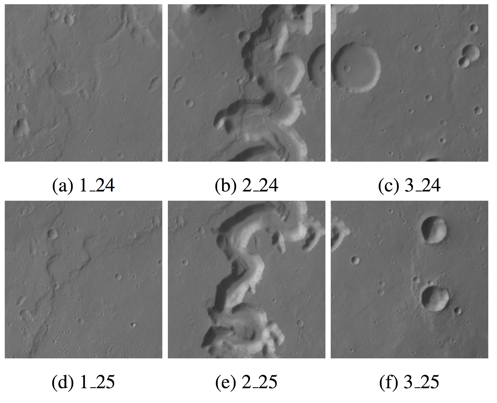
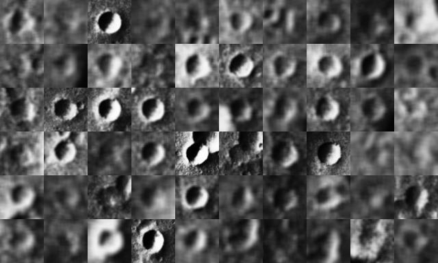

Looking for crater detection source code? Go here: https://github.com/ieee8023/cratercnn-cli

# Citations

Cohen, Joseph Paul, Henry Z. Lo, Tingting Lu, and Wei Ding. “Crater Detection via Convolutional Neural Networks.” In Lunar and Planetary Institute Science Conference Abstracts, Vol. 47, 2016. Source code: https://github.com/ieee8023/cratercnn-cli

Cohen, Joseph Paul. “Automated Crater Detection Using Machine Learning.” Graduate PhD Theses, June 1, 2016.

Bandeira, L., W. Ding, and T. F Stepinski. “Automatic Detection of Sub-Km Craters Using Shape and Texture Information.” In Proceedings of the 41st Lunar and Planetary Science Conference. The Woodlands, Texas, 2010.

Urbach, E. R, and T. F Stepinski. “Automatic Detection of Sub-Km Craters in High Resolution Planetary Images.” Planetary and Space Science 57, no. 7 (2009): 880–87.

Cohen, Joseph Paul, and Wei Ding. “Crater Detection via Genetic Search Methods to Reduce Image Features.” Advances in Space Research, 2013. doi:10.1016/j.asr.2013.05.010.

Cohen, Joseph Paul, Siyi Liu, and Wei Ding. “Genetically Enhanced Feature Selection of Discriminative Planetary Crater Image Features.” In Proceedings of the The 24th Australasian Joint Conference on Artificial Intelligence. Perth, Western Australia, 2011.

